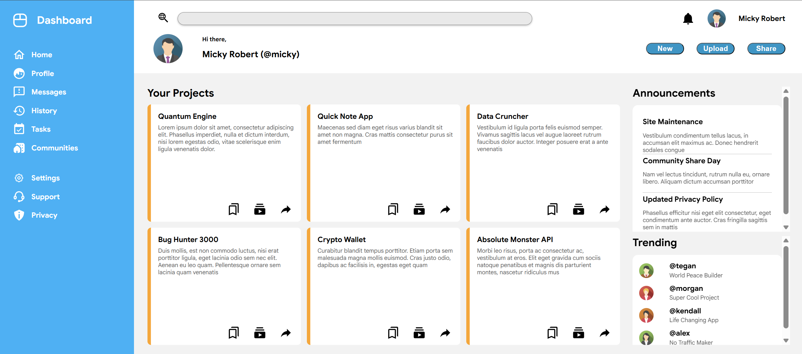

# Dashboard — The Odin Project

A responsive admin dashboard UI built as a layout exercise for [The Odin Project](https://www.theodinproject.com/) curriculum. The goal is to practice **CSS Grid and Flexbox**.



## Structure

The page is composed of four part with distinct structures:

- **Sidebar** — fixed-width column, full viewport height
- **Header** — search bar, user info, and action buttons
- **Main / Left** — a responsive grid of project cards
- **Main / Right** — two independently scrollable panels

## Layout approach: 

### Grid for structure, Flexbox for content flow

```css
body {
    height: 100vh;
    display: grid;
    grid-template: 1fr 5fr / 1fr 3.5fr;
}
```

```css
.sidebar {
    display: flex;
    flex-direction: column;
}

.left-main {
    display: flex;
    flex-direction: column;
}
```

- `body` is the outer grid: one row split for header/main, one column split for sidebar/content. 

### Responsive design

- Combining `auto-fit` for responsiveness with `1fr` rows for vertical distribution:

```css
.modules {
    flex: 1;             
    min-height: 0;   
    display: grid;
    gap: 16px;
    grid-template-columns: repeat(auto-fit, minmax(300px, 1fr));
    grid-auto-rows: 1fr; 
}
```

### Solving the overflow problem

- Cards and side panels were overflowing the *entire page* height.

- Fix overflow containment at all nesting level.

```css
.left-main,
.right-main {
    min-height: 0;
    overflow-y: auto;
}

.announcement > div,
.trending > .content {
    min-height: 0;
    overflow-y: auto;
}
```

## Built with

- HTML5
- CSS3 (Grid, Flexbox)  

## Running locally

- Open `index.html` directly inside a browser.